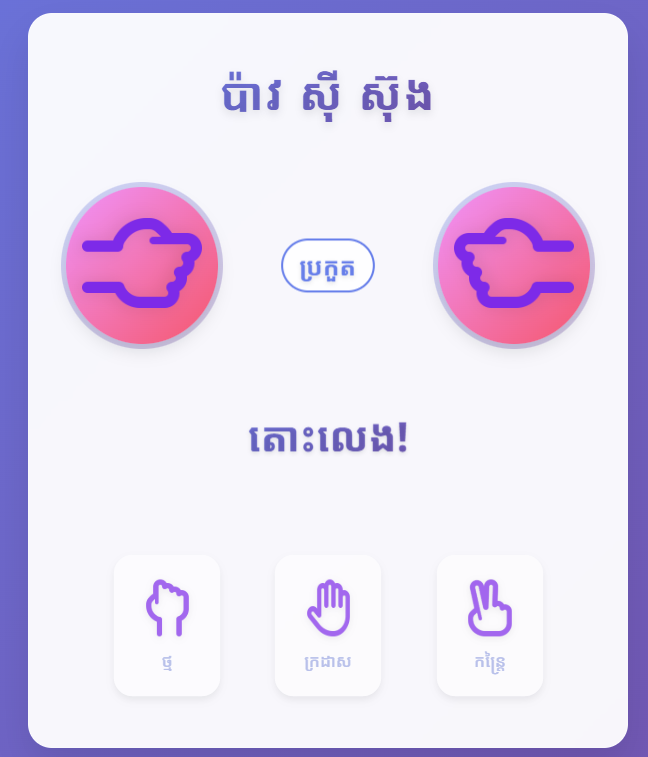

# ប៉ាវ សុី ស៊ុង (Pav Si Sung) - Khmer Rock Paper Scissors Game 🎮

<div align="center">
  
</div>

## 📖 Description

**ប៉ាវ សុី ស៊ុង** is a traditional Khmer version of the classic Rock Paper Scissors game. This web-based game features beautiful Khmer typography and a modern, responsive design that brings the beloved childhood game to the digital world.

### Game Rules (វិធីលេង):
- **ថ្ម (Rock)** beats **កន្ត្រៃ (Scissors)**
- **កន្ត្រៃ (Scissors)** beats **ក្រដាស (Paper)**
- **ក្រដាស (Paper)** beats **ថ្ម (Rock)**

## 🎯 Features

- 🇰🇭 **Full Khmer Language Support** - Complete interface in Khmer script
- 🎨 **Modern UI Design** - Beautiful gradient backgrounds and smooth animations
- 📱 **Responsive Design** - Works perfectly on desktop, tablet, and mobile devices
- ⚡ **Smooth Animations** - Engaging transitions and visual feedback
- 🎮 **Interactive Gameplay** - Click to play with instant results
- 🤖 **AI Opponent** - Play against computer with random choices

## 🚀 Demo

[Live Demo](https://your-username.github.io/Game-Pav-Si-Sung-khmer) *(Update with your GitHub Pages URL)*

## 📸 Screenshots

<div align="center">
  
  <p><em>Main game interface showing the traditional Khmer Rock Paper Scissors game</em></p>
</div>

## 🛠️ Technologies Used

- **HTML5** - Semantic markup structure
- **CSS3** - Modern styling with gradients, animations, and responsive design
- **JavaScript (ES6+)** - Game logic and interactive functionality
- **Google Fonts** - Noto Sans Khmer and Poppins fonts
- **Responsive Design** - Mobile-first approach

## 📁 Project Structure

```
Pav-Si-Sung-Khmer-Game/
├── index.html          # Main HTML file
├── style.css           # Stylesheet with Khmer font support
├── script.js           # Game logic and interactions
├── README.md           # This file
└── images/
    ├── image.png       # Game screenshot
    ├── rock.png        # Rock/ថ្ម icon
    ├── paper.png       # Paper/ក្រដាស icon
    └── scissors.png    # Scissors/កន្ត្រៃ icon
```

## 🎮 How to Play

1. **Open the game** in your web browser
2. **Choose your move** by clicking on one of the three options:
   - ថ្ម (Rock)
   - ក្រដាស (Paper)  
   - កន្ត្រៃ (Scissors)
3. **Wait for the result** - The computer will make its choice
4. **See who wins!** The result will be displayed in Khmer

### Game States:
- **ស្មើ** - It's a tie!
- **អ្នក ឈ្នះ!** - You win!
- **កុំព្យូទ័រ ឈ្នះ!** - Computer wins!

## 🚀 Getting Started

### Prerequisites
- A modern web browser (Chrome, Firefox, Safari, Edge)
- No additional installations required!

### Installation

1. **Clone the repository:**
   ```bash
   git clone https://github.com/buoysophit/Game-Pav-Si-Sung-khmer.git
   ```

2. **Navigate to the project directory:**
   ```bash
   cd Game-Pav-Si-Sung-khmer
   ```

3. **Open the game:**
   - Simply open `index.html` in your web browser
   - Or use a local server (recommended):
   ```bash
   # Using Python
   python -m http.server 8000
   
   # Using Node.js
   npx http-server
   ```

4. **Start playing!** 🎉

## 🎨 Customization

### Changing Colors
Edit the CSS variables in `style.css`:
```css
body {
  background: linear-gradient(135deg, #667eea 0%, #764ba2 100%);
}
```

### Adding Sound Effects
You can enhance the game by adding sound effects in the JavaScript file:
```javascript
// Add sound effects
const clickSound = new Audio('sounds/click.mp3');
const winSound = new Audio('sounds/win.mp3');
```

## 🤝 Contributing

Contributions are welcome! Here's how you can help:

1. **Fork the repository**
2. **Create a feature branch** (`git checkout -b feature/AmazingFeature`)
3. **Commit your changes** (`git commit -m 'Add some AmazingFeature'`)
4. **Push to the branch** (`git push origin feature/AmazingFeature`)
5. **Open a Pull Request**

### Ideas for Contributions:
- Add sound effects
- Implement score tracking
- Add more animation effects
- Create tournament mode
- Add difficulty levels
- Improve mobile responsiveness

## 📝 License

This project is licensed under the MIT License - see the [LICENSE](LICENSE) file for details.

## 👥 Authors

- **Your Name** - *Initial work* - [buoysophit](https://github.com/buoysophit)

## 🙏 Acknowledgments

- Traditional Khmer game rules and culture
- Google Fonts for Khmer typography support
- The Khmer community for preserving traditional games
- Open source community for inspiration

## 📞 Contact

- **GitHub:** [@buoysophit](https://github.com/buoysophit)
- **Project Link:** [https://github.com/buoysophit/Game-Pav-Si-Sung-khmer](https://github.com/buoysophit/Game-Pav-Si-Sung-khmer)

---

<div align="center">
  <p><strong>សូមអរគុណដែលបានលេង! (Thank you for playing!)</strong></p>
  <p>Made with ❤️ for the Khmer community</p>
</div>
